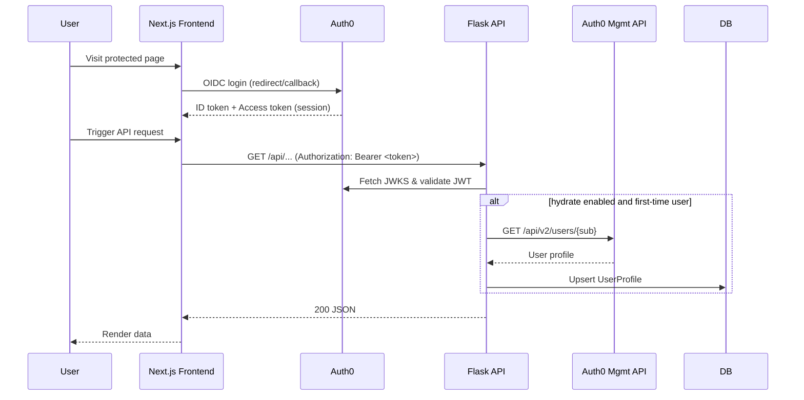
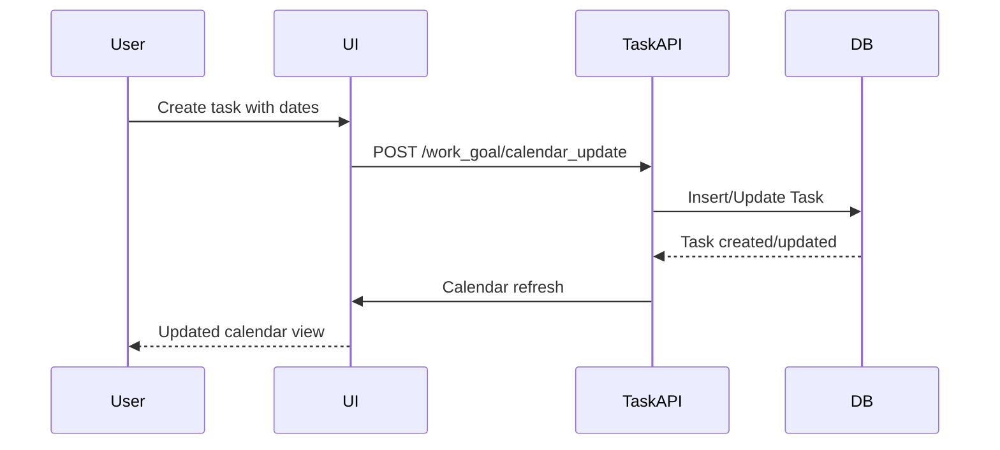
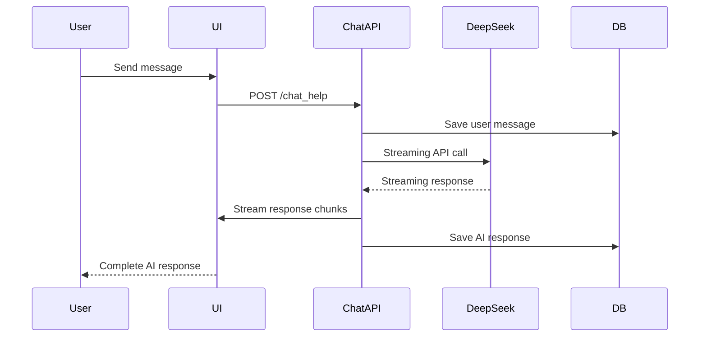
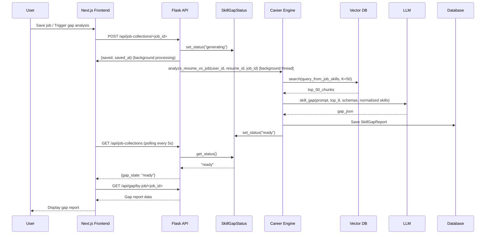
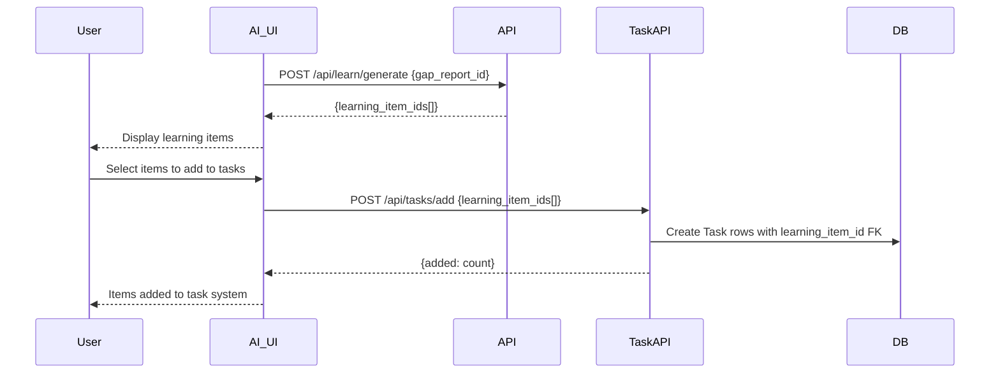
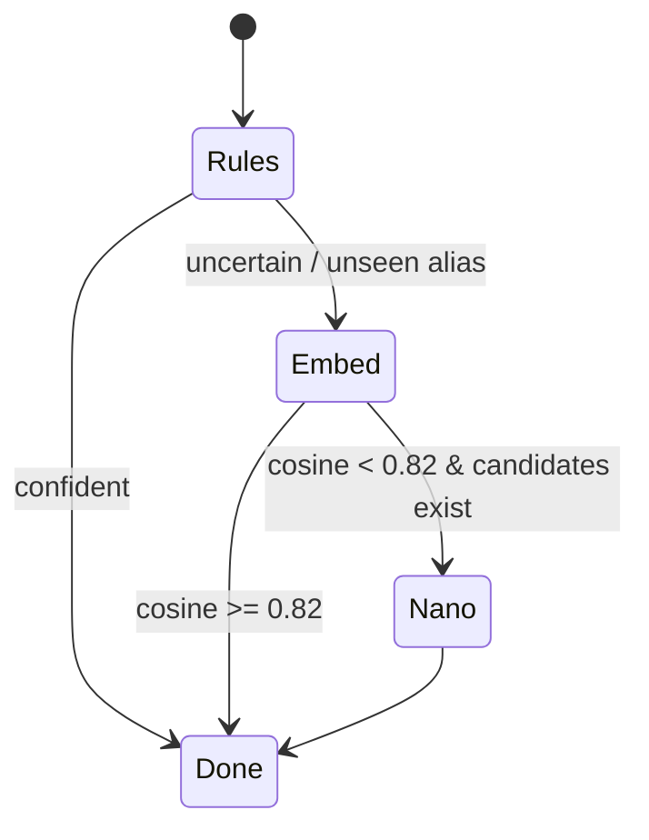

# Jobmate.Agent — End‑to‑End Workflow & Data Flow (Current Implementation)

This document sketches the *complete system workflows* including the **current implementation** (user management, tasks, goals, chat, notes) and AI features (resume → skill‑gap analysis → learning‑item generation), incorporating the lightweight classifier (rules → embeddings → tiny LLM fallback), RAG, model routing, and the updated **ontology-first data model** (`Skill`, `SkillAlias`, `SkillGapReport`). In the current skill‑only mode, `ResumeSkill`/`JobSkill` are not persisted; normalized results are captured within `SkillGapReport` JSON fields.

**Legend:** ✓ = Currently implemented, ○ = Planned for future features

**Current Implementation Status:**
- ✅ **Vector Database**: ChromaDB with O*NET skills ontology (299 core skills, 32,681 technology examples)
- ✅ **Gap Analyzer**: Level-aware skill gap analysis with O*NET mapping
- ✅ **Career Engine**: Complete skill-only analysis pipeline (one-shot LLM extractor)
- ✅ **Resume Management**: S3 storage, parsing, and text extraction
- ✅ **O*NET Integration**: Comprehensive skills database with vector embeddings
- ✅ **Frontend Foundation**: Next.js 15 with Auth0, basic components, and API proxy

---

## 1) High‑level System Diagram

### Current Implementation (✓)
```mermaid
flowchart LR
  subgraph Client_Current[Current Client (✓)]
    UI_Current[Jinja2 Templates: Dashboard, Work Goal, Chat]
  end

  subgraph API_Current[Current Backend (✓)]
    AUTH[Authentication Service]
    TASK[Task Management]
    GOAL[Goal Management]
    CHAT[Chat Service]
    NOTE[Notes Service]
    CAL[Calendar Service]
  end

  subgraph Stores_Current[Current Storage (✓)]
    SQL_Current[(PostgreSQL/SQLite: UserProfile (Auth0), User (legacy), Goal, Task, Note, Chat, ChatMessage, Membership, UserSettings)]
    JWT[JWT Tokens]
  end

  UI_Current -->|Login/Register| AUTH
  UI_Current -->|Manage Tasks| TASK
  UI_Current -->|Manage Goals| GOAL
  UI_Current -->|AI Chat| CHAT
  UI_Current -->|Manage Notes| NOTE
  UI_Current -->|Calendar View| CAL

  AUTH --> SQL_Current
  TASK --> SQL_Current
  GOAL --> SQL_Current
  CHAT --> SQL_Current
  NOTE --> SQL_Current
  CAL --> SQL_Current
```

### Implemented AI Features (✓)
```mermaid
flowchart LR
  subgraph Client_AI[AI Client (✓)]
    UI_AI[Next.js: Upload, Gap Report, Learning Items]
  end

  subgraph API_AI[AI Backend (✓)]
    UPL[Upload Service]
    PARSE[Parser/OCR]
    CLS[Lightweight Classifier]
    ONT[Ontology Normalizer]
    IDX[Indexing]
    RETR[Retriever]
    RER[Reranker (optional)]
    GAP[Skill‑Gap Chain]
    LEARN[Learning‑Items Chain]
    EVAL[Self‑Eval/Guardrails]
    OBS[Telemetry/Token Budget]
  end

  subgraph Stores_AI[AI Storage (✓)]
    RAW[(Object Store: PDF/Docx - S3)]
    SQL_AI[(PostgreSQL/SQLite: Resume, JobListing, Skill, SkillAlias, SkillGapReport, SkillGapStatus, PreloadedContext, LearningItem, ProcessingRun, UserProfile)]
    VEC[(Chroma Vector DB: skills_ontology only)]
    ONTO[(O*NET Skills Ontology + Synonyms)]
  end

  UI_AI -->|1. Upload Resume/JD| UPL
  UPL --> RAW
  UPL --> PARSE
  PARSE -->|Text + Spans| CLS
  CLS -->|Tagged Spans| ONT
  ONT -->|Canonical Skills (skill_id)| IDX
  IDX -->|Upsert| VEC
  IDX -->|Meta (vector_doc_id)| SQL_AI

  UI_AI -->|2. Analyze (resume↔JD)| RETR
  RETR -->|top‑K| RER
  RER -->|top‑k*| GAP
  GAP -->|structured JSON| EVAL
  EVAL -->|approve/repair| LEARN
  LEARN -->|learning items JSON| UI_AI

  ONTO <--> SQL_AI
  OBS <--> API_AI
```

### Integration Points
- **User Model**: `UserProfile` (Auth0 identity) owns AI entities (Resume, JobCollection, SkillGapReport, SkillGapStatus, PreloadedContext). Legacy `User` model owns current entities (Task, Goal, Note) for templates only.
- **Task Integration**: Current Task.learning_item_id links to AI-generated LearningItem
- **Notes Integration**: Current Note system stores AI insights and user annotations
- **Chat Integration**: Chat references `UserProfile.id`, can be extended for AI resume analysis interactions

> *k* is initial K (e.g., 30–50). *k** is reranked K (e.g., 6–10).

---

## 2) Data Flow (Step‑by‑Step)

### Current Implementation (✓)

#### A. User Authentication & Management (✓)
1. **Auth0 Authentication**: User authenticates via Auth0 → Next.js frontend receives JWT Access Token
2. **JWT Validation**: Frontend sends `Authorization: Bearer <token>` header → Flask `@require_jwt` validates token via JWKS
3. **User Profile Hydration**: Optional `hydrate=True` in `@require_jwt` → fetches user from Auth0 Management API → upserts `UserProfile` (id = Auth0 `sub`)
4. **Dashboard**: JWT validation → user data from `UserProfile` + task/goal counts → dashboard rendered
5. **Legacy Auth**: Legacy `User` model with bcrypt exists only for server-rendered Jinja templates (not used by Next.js)

#### B. Task & Goal Management (✓)
1. **Goal Creation**: User creates goal with title/description → `Goal` row with `user_id` FK (legacy User model for templates)
2. **Task Creation**: User creates task with dates, associates with goal → `Task` row with `goal_id` FK and optional `learning_item_id` FK
3. **Calendar Integration**: Tasks with dates → calendar events → drag-and-drop date updates
4. **Task Completion**: User marks task complete → `Task.done` updated → calendar refresh

#### C. Notes & Chat System (✓)
1. **Note Creation**: User creates note, optionally links to task → `Note` row with `task_id` FK
2. **AI Chat**: User sends message → DeepSeek API call → streaming response → `ChatMessage` rows (Chat references `UserProfile.id`)
3. **Note from Chat**: User saves AI response as note → `Note` row created with AI content
4. **PreloadedContext**: Precomputed context snippets stored in `PreloadedContext` for chat system messages

### Implemented AI Features (✓)

#### A. Resume & Job Ingest & Parsing (✓ COMPLETED)
1. **Upload**: resume.pdf / resume.docx / .txt via `POST /api/backend/resume/upload`.
2. **Parse**: `pypdf` / `python-docx` / text decoder; normalize; pipeline stores minimal `parsed_json` (page_count, word_count, warnings, text_preview, raw_text_sha256).
3. **Persist**:\
   - RAW → S3 (`s3_bucket`, `s3_key` stored).\
   - SQL → `Resume` rows with `processing_run_id`; `status` transitions to `completed` after processing.

#### B. Lightweight Classification (✓ IMPLEMENTED)
**Goal**: tag phrases as `SKILL_TECH`, `TOOL`, `CLOUD`, `DOMAIN`, `CERT`, `SOFT_SKILL` (cheap → flexible):
1. **Rules/Dictionary** (case‑insensitive with blocklist).\
2. **Embeddings pass** → nearest neighbor over **skills_ontology** vectors; accept if cosine ≥ **0.82**.\
3. **Tiny LLM fallback** (nano/flash‑lite) with strict JSON for ambiguous phrases only.

**Per‑segment output**:
```json
{
  "text": "Built CI/CD with Docker and Jenkins on AWS",
  "tags": [
    {"type": "TOOL", "value": "Docker"},
    {"type": "TOOL", "value": "Jenkins"},
    {"type": "CLOUD", "value": "AWS"}
  ],
  "spans": [[0, 43]]
}
```

#### C. Ontology Normalization (✓ IMPLEMENTED)
- Map tag `value` → **Skill.skill_id** via `SkillAlias` or semantic NN over `skills_ontology`. Normalized results are used in-memory and embedded into `SkillGapReport.*_skills_json`.
- Keep canonical taxonomy in `Skill.taxonomy_path` (e.g., `ENGINEERING/FRONTEND/REACT`).

#### D. Embedding & Indexing (✓ IMPLEMENTED)
- In current mode, only skills ontology is embedded; resumes/jobs are not added to vector DB. Example skill metadata:
```json
{
  "doc_id": "skill:123",
  "skill_type": "skill",
  "skill_id": "python",
  "name": "Python",
  "framework": "ONET",
  "external_id": "2.B.1.1"
}
```
- Store **pointers** only in SQL: `Skill.vector_doc_id` (O*NET skills only in skill-only mode).
#### K. Download Flow (✓ IMPLEMENTED)
- `GET /api/backend/resume/<id>/download-url` returns presigned link. UI calls on click (no caching), opens in new tab.

#### E. Retrieval & Reranking (✓ IMPLEMENTED)
1. Build structured **query** from JD's `JobSkill` rows.\
2. `retriever.search(K=50)` over `skills_ontology` only (skill-only mode).\
3. **Optional Reranker** (e.g., Cohere v3.5 / Vertex Re‑rank) to trim top‑50 → **top‑8**.\
4. Respect token budgets by pruning lowest‑relevance chunks if necessary.

#### F. Skill‑Gap Chain (✓ IMPLEMENTED)
- **Inputs**: normalized skills from resume and job (computed at runtime, not persisted as `ResumeSkill`/`JobSkill` rows) + top‑k chunks.\
- **Processing**: Background processing triggered → `SkillGapStatus.set_status("generating")` → Career Engine runs analysis
- **Output**: `SkillGapReport` row with:
  - `matched_skills_json` (skill_id, evidence, level, confidence)\
  - `missing_skills_json` (skill_id, required_level, rationale)\
  - `weak_skills_json` (optional)\
  - `resume_skills_json` (all detected resume skills with levels)\
  - `analysis_version` (version identifier)\
  - `analysis_json` (additional analysis metadata)\
  - `score` = weighted coverage (0-100).
- **Status Update**: `SkillGapStatus.set_status("ready")` → frontend polling detects status change
- **LLM config**: structured JSON schema, temperature **0.2**, retry with `reask` on validation errors.

#### G. Learning‑Items Chain (○ PLANNED)
- For **missing/weak** skills, query `learning_corpus`; synthesize **LearningItem** rows and link via **ReportLearningItem**.\
- **LLM config**: temperature **0.5**, strict schema (title, est_hours, resource{title,url}, difficulty).

#### H. Integration with Current Task System (○ PLANNED)
- **Learning Items → Tasks**: AI-generated learning items → `Task` rows with `learning_item_id` FK
- **User Workflow**: User reviews learning items → selects items → adds to existing task/goal system
- **Calendar Integration**: Learning tasks appear in current calendar interface
- **Notes Integration**: AI insights stored in current `Note` system

#### I. Guardrails & Self‑Eval (✓ IMPLEMENTED)
- Validate JSON schemas, numeric ranges, and required fields.\
- Optional second‑pass critique on a small subset before persisting.\
- All runs tracked via `ProcessingRun` for reproducibility.

#### J. Observability & Token Budget (✓ IMPLEMENTED)
- Log **token counts**, **latency**, **model**, **K/K***, **temperature**, **reranker on/off**.\
- Enforce per‑route token budgets; emit warnings when trimming occurs.

---

## 3) Control Flow (Sequence Diagrams)

### Current Implementation (✓)

#### 3.1 User Authentication Flow (✓)


#### 3.2 Task Management Flow


#### 3.3 AI Chat Flow


### Implemented AI Features (✓)

#### 3.4 Analyze Resume vs JD (✓ IMPLEMENTED)


#### 3.5 Learning Items → Current Task System (○ PLANNED)


#### 3.6 Classifier Routing (✓ IMPLEMENTED)


---

## 4) Minimal Interfaces (Data Contracts)

### 4.1 Classifier → Normalizer
```json
{
  "segments": [
    {
      "segment_id": "s1",
      "text": "...",
      "tags": [{"type": "TOOL", "value": "Docker"}],
      "spans": [[0, 42]]
    }
  ]
}
```

### 4.2 Normalizer → Indexer
```json
{
  "doc_id": "resume:123",
  "canonical_tags": [
    {"skill_id": "tool.docker", "category": "TOOL"},
    {"skill_id": "cloud.aws.ec2", "category": "CLOUD"}
  ],
  "segments": [
    {"segment_id": "s1", "text": "...", "skill_ids": ["tool.docker"]}
  ]
}
```

### 4.3 Gap Report Schema
```json
{
  "$schema": "https://json-schema.org/draft/2020-12/schema",
  "type": "object",
  "required": ["match_score", "present_skills", "missing_skills", "gaps"],
  "properties": {
    "match_score": {"type": "number", "minimum": 0, "maximum": 1},
    "present_skills": {"type": "array", "items": {"type": "object", "required": ["skill_id", "evidence"]}},
    "missing_skills": {"type": "array", "items": {"type": "object", "required": ["skill_id", "priority"]}},
    "gaps": {"type": "array", "items": {"type": "object", "required": ["skill_id", "level_needed", "confidence"]}}
  }
}
```

### 4.4 Learning Items Schema
```json
{
  "$schema": "https://json-schema.org/draft/2020-12/schema",
  "type": "array",
  "items": {
    "type": "object",
    "required": ["skill_id", "items"],
    "properties": {
      "skill_id": {"type": "string"},
      "items": {
        "type": "array",
        "items": {
          "type": "object",
          "required": ["title", "est_hours", "resource", "difficulty"],
          "properties": {
            "title": {"type": "string"},
            "est_hours": {"type": "number", "minimum": 0},
            "resource": {"type": "object", "required": ["title", "url"]},
            "difficulty": {"type": "string", "enum": ["beginner", "intermediate", "advanced"]}
          }
        }
      }
    }
  }
}
```

---

## 5) Token Budgeting & Retrieval Settings
- **Budget per request**: 8k–16k tokens (default routes), 32k+ where available.\
- **Chunk size**: 500–800 tokens; overlap 10–15%.\
- **Retriever**: `K=50` initial; **rerank** to `k=8`.\
- **JD ↔ Resume**: usually < 2k tokens combined; the rest is retrieved context.

---

## 6) Model Plan & Routing
- **LLM (primary)**: `gpt-5-mini` *or* `gemini-2.5-flash`.\
  - Skill‑gap: temp **0.2**, strict JSON, retries with `reask`.\
  - Learning items: temp **0.5**, strict JSON; guardrail on output length.
- **Embeddings**: `text-embedding-3-small` (upgrade to **…-large** for multilingual).\
- **Optional Rerank**: Cohere v3.5 (API) or Vertex Re‑rank.\
- **Tiny LLM (classifier fallback)**: `gpt-5-nano` / `gemini-flash-lite`.\
- **Upgrade path**: route low‑confidence cases to `gpt‑5`.

---

## 7) Env & Config Sketch
```bash
# Models
LLM_MODEL=gpt-5-mini            # or gemini-2.5-flash
EMBEDDING_MODEL=text-embedding-3-small
RERANK_MODEL=cohere.rerank-v3.5 # optional
CLASSIFIER_NANO=gpt-5-nano      # or gemini-flash-lite

# Retrieval
RETRIEVE_K=50
RERANK_K=8
CHUNK_TOKENS=600
CHUNK_OVERLAP=0.12

# Budgets & Temps
TOKEN_BUDGET=16000
SKILL_GAP_TEMP=0.2
LEARNING_ITEMS_TEMP=0.5

# Thresholds
EMBED_ACCEPT=0.82
CONFIDENCE_ROUTE_UPGRADE=0.6
```

---

## 8) LangChain Wiring (Pseudo‑Code)
```python
# Retriever
retriever = vector_store.as_retriever(search_kwargs={"k": int(os.getenv("RETRIEVE_K", 50))})
reranker = CohereRerank(model=os.getenv("RERANK_MODEL")) if use_rerank else None

# Classifier Router
def classify(text):
    tags = rules_tag(text)
    if confident(tags):
        return tags
    cand = embed_match(text, threshold=float(os.getenv("EMBED_ACCEPT", 0.82)))
    if cand:
        return cand
    return nano_llm_tag(text)  # gpt-5-nano / flash-lite

# Skill‑Gap Chain
gap_chain = (
    {"chunks": retriever}
    | (reranker if reranker else passthrough)
    | llm_json(model=os.getenv("LLM_MODEL"), temp=float(os.getenv("SKILL_GAP_TEMP", 0.2)), schema=GapSchema)
)

# Learning Items Chain
items_chain = llm_json(
    model=os.getenv("LLM_MODEL"),
    temp=float(os.getenv("LEARNING_ITEMS_TEMP", 0.5)),
    schema=LearningItemsSchema,
)

# Orchestrate
def analyze(resume_id, job_target_id):
    jd_struct = build_jd_query(job_target_id)
    chunks = gap_chain.invoke(jd_struct)
    gap = chunks["gap"]
    if gap.get("confidence", 1.0) < float(os.getenv("CONFIDENCE_ROUTE_UPGRADE", 0.6)):
        gap = llm_json(model="gpt-5").invoke(jd_struct)  # upgrade path
    items = items_chain.invoke({"gaps": gap["missing_skills"], "resources": retrieve_learning_corpus(gap)})
    return {"gap_report": gap, "learning_items": items}
```

---

## 9) UI Notes

### Current Implementation (✓)
- **Dashboard**: User overview with goals, tasks, and chat access
- **Work Goal**: Calendar-based task management with drag-and-drop scheduling
- **Task Management**: Create/edit/delete tasks with goal association and date scheduling
- **Notes System**: Create/edit/delete notes with optional task linking
- **Chat Interface**: AI conversations with DeepSeek, save responses as notes
- **User Center**: Profile management, membership settings, user preferences

### Implemented AI Features (✓)
- **Upload Interface**: Drag-and-drop resume upload with progress indicators
- **Gap Report View**: Two panes: **Gap Report** (coverage %, missing skills, evidence) + **Learning Plan** (cards with duration, resource link, difficulty, "Add to tasks")
- **Evidence Modal**: Detailed skill evidence with confidence scores and rationale
- **Dev Tools**: Token/latency info in dev toolbar for easy A/B during development

### Planned AI Features (○)
- **Learning Integration**: AI-generated learning items seamlessly integrate with current task system
- **Export Features**: JSON/CSV export of gap reports and learning items

### Integration Points
- **Dashboard Extension**: Add resume upload section to existing dashboard
- **Work Goal Integration**: Gap reports and learning items appear in current work goal interface
- **Task System**: AI-generated learning items become tasks in current calendar system
- **Notes Enhancement**: AI insights and gap analysis stored in current notes system

---

## 10) Next Steps

### Current System Maintenance (✓)
- Monitor and optimize current task/goal/chat performance
- Enhance user experience based on current feature usage
- Maintain DeepSeek API integration stability

### AI Features Implementation (✓ COMPLETED)
- ✅ Implement classifier router (rules + embeddings; nano fallback later)
- ✅ Wire strict JSON schemas with auto‑retry (`reask`) on validation errors
- ✅ Add reranker and confidence‑based routing once baseline is stable
- ✅ Log per‑run costs; export CSV for quick compare of GPT‑5‑mini vs Gemini Flash

### Integration Development (✓ COMPLETED)
- ✅ Extend current Task model with learning_item_id field
- ✅ Add AI features to existing UI sections (dashboard, work_goal)
- ✅ Implement seamless learning item → task workflow
- ✅ Maintain backward compatibility with current user workflows

### Career Engine Implementation (✓ COMPLETED)
- ✅ **Complete Career Engine**: Full skill gap analysis pipeline implemented
- ✅ **O*NET Integration**: 299 core skills with 32,681 technology examples
- ✅ **Level-Aware Analysis**: Skill level estimation for candidates and requirements
- ✅ **Vector Search**: Semantic matching using OpenAI embeddings
- ✅ **Report Generation**: Markdown reports with detailed skill analysis
- ✅ **Database Integration**: SkillGapReport model and persistence
- ○ **REST API Endpoints**: Direct Python API available, REST endpoints pending
