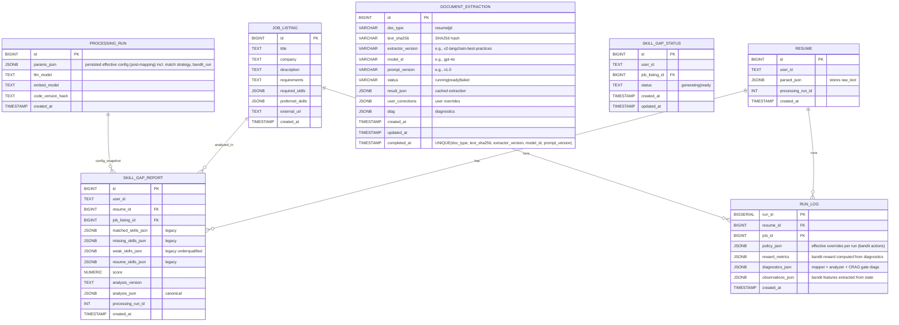
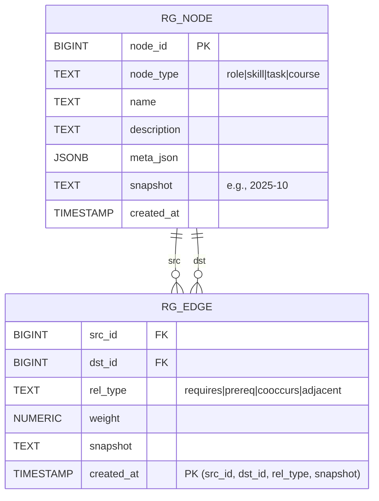
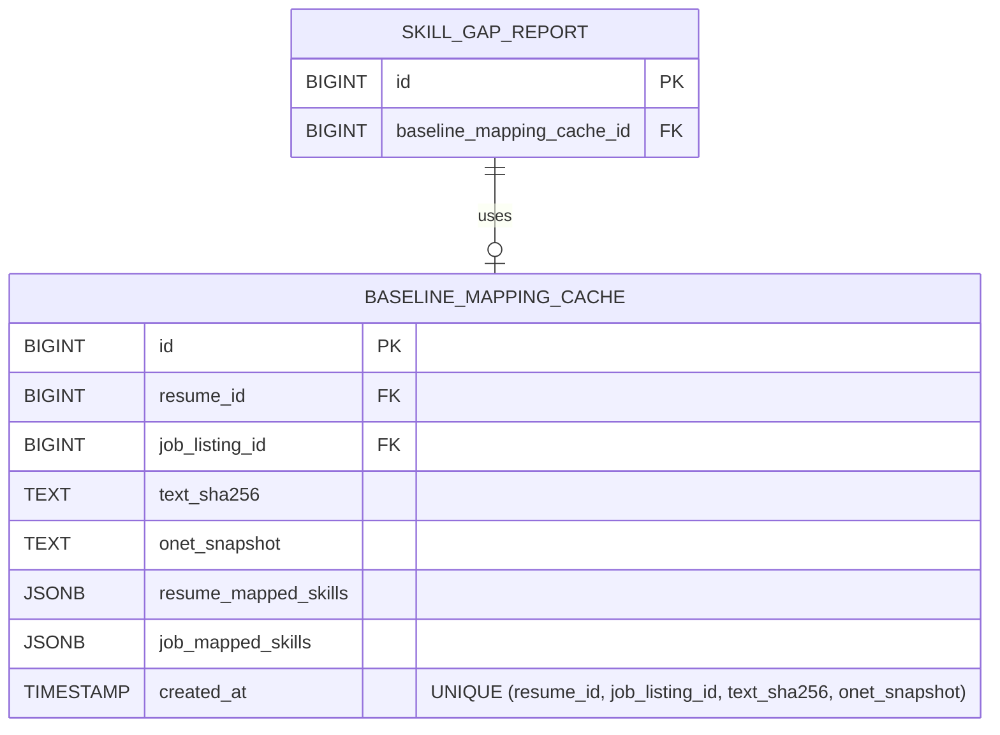

# Adjusted Lightweight ERD (Mermaid)

This diagram reflects the **actual models** in your codebase (Resume, JobListing, SkillGapReport/Status), adds **DocumentExtraction** caching table (v5 Phase A), optional **run_log** for RL eval, and shows a **RoleGraph** sidecar. It aligns with the v5 (Aligned) execution plan.

**Status**: ✅ Updated to align with v5 (Aligned) execution plan — Phase A caching via `DocumentExtraction` table.

---

## 1) Core Models, Engine Artifacts, Document Extraction Cache, and (Optional) Run Log

**Notes**
- **`DOCUMENT_EXTRACTION` (v5 Phase A)**: Primary caching table for resume/JD skill extraction results. Uses composite unique key `(doc_type, text_sha256, extractor_version, model_id, prompt_version)` to support idempotent getters with row-level locking (`SELECT FOR UPDATE SKIP LOCKED`). Status flow: `running` → `ready` → served to getters. User corrections can overlay cached results.
- **`RESUME.parsed_json`**: Still stores raw text; extraction results now cached in `DOCUMENT_EXTRACTION` table instead.
- **`RUN_LOG`**: **Optional**; you can start with logging to `ProcessingRun.params_json` under key `bandit_run` for shadow mode. Add this table later if you need SQL-queryable RL analysis.
- **`PROCESSING_RUN.params_json`**: Stores `{match_strategy: {...}, score_weights: {...}, extraction: {...}, bandit_run: {obs, act, reward}}` - full provenance chain.

---

## 2) Document Extraction Cache Details (v5 Phase A)

**Key Features:**
- **Idempotent getters**: `get_resume_skills()` and `get_jd_skills()` use `DocumentExtraction` for caching
- **Concurrent-safe**: Row-level locking prevents duplicate extractions
- **Version-aware**: Cache invalidates on `extractor_version`, `model_id`, or `prompt_version` changes
- **User corrections**: `user_corrections JSONB` field allows HITL overlays (chat mode) without invalidating cache

**Indexes:**
- Lookup index on composite key columns
- Partial index on `status='running'` for efficient join-wait queries

**Relationship**: No direct FK relationships; looked up by text hash + version components. Used by `CareerEngine` extraction phase (Phase A integration).

---

## 3) RoleGraph Sidecar (GraphRAG) - Optional Phase 5

**Flow**
- `role_graph_suggest(resume_id, target_role?, k)` seeds from cached mapped skills/levels → PPR/paths → (optional) vector rerank → RAG explanation text → return role cards & learning paths.

**Note**: GraphRAG is **optional (Phase 5)**. Start with CRAG + Bandit in Phases 1-4.

---

## 4) Optional Baseline Mapping Cache (Future Enhancement)

**Current**: No mapping cache exists. Every request recomputes O*NET mapping via ChromaDB.

**Phase 4 Consideration**: Add baseline cache if repeated analyses become performance bottleneck.

**Recommendation**: Defer to Phase 4. Start without cache; add only if needed for A/B testing or performance.

---

## 5) Diagnostics Surfaces for CRAG & RL (v5 Phases B-C)

- **Mapper diagnostics** (`get_last_mapping_diagnostics()`) — v5 Phase B: `{total_tokens_processed, total_tasks_processed, total_accepted, total_dropped, total_ambiguous, average_cutoff, strategy, skill_diagnostics: [{token, total_hits, accepted_count, dropped_count, literal_text_rejected, cutoff_used, top_scores}], task_diagnostics: [...]}`.
- **CRAG gate summary** (v5 Phase C): `{total_gate_actions, actions: [{token, action, topk_increased, recipe_switched, floor_adjusted}], summary: {increased_topk: count, switched_recipe: count, ...}}`.
- **HITL diagnostics** (v5 Phase F): `{mode: "off|auto", skipped: boolean, assumptions: [...]}` attached to `analysis.extras.hitl`.
- **Analyzer diagnostics**: `{resume_items, job_items, resume_skills, matched_count, missing_count}`.
- **Perf metrics**: `{tokens_used, latency_ms, extraction_time_ms, mapping_time_ms, analysis_time_ms}`.
- **Bandit observations** (optional): `{extractor_stats, mapper_diagnostics, gap_summary, tokens, time}`.
- Attach these in `diagnostics_json` (RUN_LOG), `ProcessingRun.params_json['bandit_run']`, `DocumentExtraction.diag`, and return alongside `analysis_json` for offline evaluation.

---

## Summary

This ERD reflects the **v5 (Aligned) execution plan** data model with enhancements for:
1. **Phase A - Document Extraction Cache**: `DOCUMENT_EXTRACTION` table for idempotent extraction caching with row-level locking (primary caching mechanism).
2. **Phase B - Request-scoped overrides & diagnostics**: Config overrides persisted to `ProcessingRun.params_json`, diagnostics surfaced in `analysis.extras`.
3. **Phase C - CRAG gate**: Diagnostics added to mapper output for progressive trigger decisions; bounded retries with conservative fallbacks.
4. **Phase F - HITL diagnostics**: `analysis.extras.hitl` captures mode, skipped flags, and assumptions (chat-only when `hitl_mode="auto"`).
5. **Optional baseline mapping cache**: Deferred to Phase 4 based on performance needs (complements `DOCUMENT_EXTRACTION`).
6. **Optional `RUN_LOG`**: Can start with logging to `ProcessingRun.params_json['bandit_run']` instead; add table if SQL-queryable RL analysis needed.
7. **GraphRAG sidecar**: Completely optional, Phase 5+ implementation.

**Key Points**:
- **`DOCUMENT_EXTRACTION` is the primary cache** (Phase A); replaces previous `parsed_json` extraction caching.
- **`RUN_LOG` is optional**; start with `ProcessingRun.params_json` logging for shadow mode.
- Add tables only as needed for SQL analysis or performance optimization.
