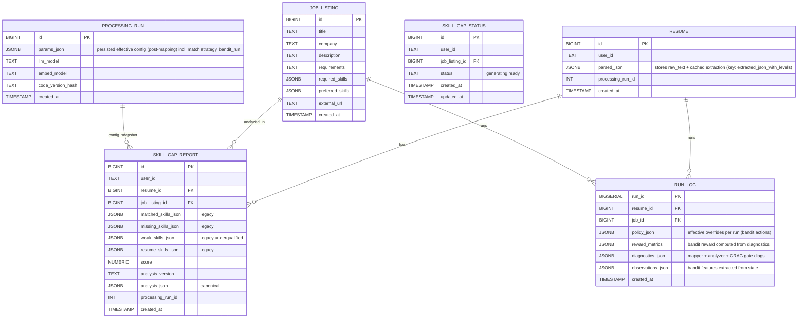

# Adjusted Lightweight ERD (Mermaid)

This diagram reflects the **actual models** in your codebase (Resume with `parsed_json`, JobListing, SkillGapReport/Status), adds optional **run_log** for RL eval, and shows a **RoleGraph** sidecar. It avoids hypothetical `DOC_TEXT` and uses your existing persistence patterns.

**Status**: ✅ Updated based on corrected CareerEngine_Uplift_Adjusted.md plan.

---

## 1) Core Models, Engine Artifacts, and (Optional) Run Log

**Notes**
- `parsed_json` is used to cache resume extraction with key `extracted_json_with_levels`; validation via `extractor_version`. JD enrichment happens on the fly from `description/requirements` (plus structured arrays when present).
- `RUN_LOG` is **optional**; you can start with logging to `ProcessingRun.params_json` under key `bandit_run` for shadow mode. Add this table later if you need SQL-queryable RL analysis.
- `PROCESSING_RUN.params_json` now stores: `{match_strategy: {...}, score_weights: {...}, extraction: {...}, bandit_run: {obs, act, reward}}` - full provenance chain.

---

## 2) RoleGraph Sidecar (GraphRAG) - Optional Phase 5

**Flow**
- `role_graph_suggest(resume_id, target_role?, k)` seeds from cached mapped skills/levels → PPR/paths → (optional) vector rerank → RAG explanation text → return role cards & learning paths.

**Note**: GraphRAG is **optional (Phase 5)**. Start with CRAG + Bandit in Phases 1-4.

---

## 4) Optional Baseline Mapping Cache (Future Enhancement)

**Current**: No mapping cache exists. Every request recomputes O*NET mapping via ChromaDB.

**Phase 4 Consideration**: Add baseline cache if repeated analyses become performance bottleneck.

**Recommendation**: Defer to Phase 4. Start without cache; add only if needed for A/B testing or performance.

---

## 5) Diagnostics Surfaces for CRAG & RL

- **Mapper diagnostics** (`get_last_mapping_diagnostics()`): `{total_tokens_processed, total_tasks_processed, total_accepted, total_dropped, total_ambiguous, average_cutoff, strategy, skill_diagnostics: [{token, total_hits, accepted_count, dropped_count, literal_text_rejected, cutoff_used, top_scores}], task_diagnostics: [...]}`.
- **CRAG gate summary** (new): `{total_gate_actions, actions: [{token, action, topk_increased, recipe_switched, floor_adjusted}], summary: {increased_topk: count, switched_recipe: count, ...}}`.
- **Analyzer diagnostics**: `{resume_items, job_items, resume_skills, matched_count, missing_count}`.
- **Perf metrics**: `{tokens_used, latency_ms, extraction_time_ms, mapping_time_ms, analysis_time_ms}`.
- **Bandit observations**: `{extractor_stats, mapper_diagnostics, gap_summary, tokens, time}`.
- Attach these in `diagnostics_json` (RUN_LOG), `ProcessingRun.params_json['bandit_run']`, and return alongside `analysis_json` for offline evaluation.

---

## Summary

This ERD reflects the **current data model** with enhancements for:
1. **Request-scoped overrides**: Bandit actions stored in `RUN_LOG` or `ProcessingRun.params_json`
2. **CRAG gate**: Diagnostics added to mapper output for progressive trigger decisions
3. **Optional baseline cache**: Deferred to Phase 4 based on performance needs
4. **GraphRAG sidecar**: Completely optional, Phase 5 implementation

**Key Point**: Start with `RUN_LOG` as optional (can log to `ProcessingRun.params_json` instead). Add tables only as needed for SQL analysis.
