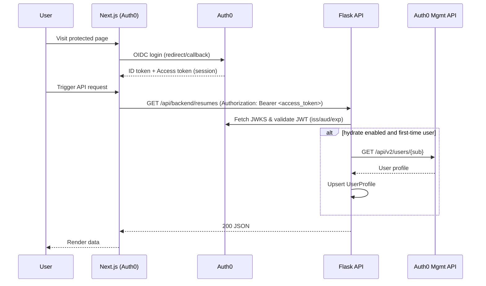

## Authentication Workflow

### Overview

This document describes how authentication works across the Next.js frontend and the Flask backend. The system currently supports two parallel modes:

- **OIDC with Auth0 (recommended)**: Next.js handles login with Auth0. Frontend obtains a JWT Access Token and calls Flask APIs with `Authorization: Bearer <token>`. Flask validates tokens, checks scopes, and can hydrate a `UserProfile` via Auth0 Management API.
- **Legacy Flask session auth**: Username/password handled by `blueprints/auth.py` for server-rendered Jinja templates. This does not impact the Next.js flow and will be phased out.

### Components & Locations

- Frontend Auth SDK: `frontend/src/lib/auth0.ts`
- Frontend route protection: `frontend/src/middleware.ts`
- Backend JWT validation and user hydration: `jwt_auth.py`
- Legacy session auth (templates only): `blueprints/auth.py`

### Environment Variables

Frontend (Next.js):
- `AUTH0_DOMAIN`: Your Auth0 tenant domain (e.g., `https://dev-xxxxx.us.auth0.com`)
- `AUTH0_CLIENT_ID`
- `AUTH0_CLIENT_SECRET` (server-side only; used by SDK)
- `APP_BASE_URL` (e.g., `http://localhost:3000`)
- `AUTH0_SCOPE`: Space-delimited scopes requested for the Access Token (e.g., `openid profile email read:resumes`)
- `AUTH0_AUDIENCE`: The API Identifier configured in Auth0 for the Flask API

Backend (Flask):
- `AUTH0_DOMAIN`: Same domain as above (full URL, e.g., `https://dev-xxxxx.us.auth0.com`)
- `AUTH0_AUDIENCE`: Must match your API Identifier in Auth0
- `AUTH0_MGMT_CLIENT_ID`: Auth0 Machine-to-Machine app client id (for Management API)
- `AUTH0_MGMT_CLIENT_SECRET`: Secret for the above

Notes:
- The backend derives JWKS URL from `AUTH0_DOMAIN` and validates RS256 tokens.
- Management API credentials are used only when hydration is enabled to fetch user profile details.

### Frontend Flow (Auth0 + Next.js)

1) User visits a protected page in Next.js.
2) `middleware.ts` runs `auth0.middleware(request)` to handle session and route protection.
3) On login, the SDK performs OIDC with Auth0 and establishes a session in Next.js.
4) For API calls to Flask, the frontend passes the JWT Access Token in the `Authorization` header.

Middleware behavior (from `frontend/src/middleware.ts`):
- Allows `/auth/*` routes to pass through to the SDK.
- Treats `/` as public.
- Matches all other routes except Next static assets and `/api/*` (Next.js internal) for middleware handling.

### Backend Flow (Flask + JWT)

Use the `require_jwt` decorator from `jwt_auth.py` on protected routes. The decorator:

- Extracts `Authorization: Bearer <token>`.
- Fetches the signing key via JWKS from `AUTH0_DOMAIN`.
- Validates token with `aud` = `AUTH0_AUDIENCE`, `iss` = `AUTH0_DOMAIN` + `/`, algorithm RS256.
- Checks required scopes (from either `permissions` claim array or `scope` space-delimited string).
- Exposes `g.jwt_payload` and `g.user_sub` for downstream handlers.
- Optional hydration: when `hydrate=True`, fetches the user from Auth0 Management API and upserts into `UserProfile` (id = `sub`). On first creation, it mirrors name/email to contact fields.

Example usage in Flask:

```python
from flask import Blueprint, jsonify
from jwt_auth import require_jwt

api_bp = Blueprint("api", __name__)

@api_bp.route("/api/backend/resumes", methods=["GET"])
@require_jwt(required_scopes=["read:resumes"], hydrate=True)
def list_resumes():
    # Access g.user_sub, g.user_profile as needed
    return jsonify({"items": []})
```

### Request Examples

Fetch from frontend (browser/client):

```ts
// Assume you obtained an access token from the Auth0 SDK
const res = await fetch(`${process.env.NEXT_PUBLIC_API_BASE_URL}/api/backend/resumes`, {
  headers: {
    Authorization: `Bearer ${accessToken}`,
  },
});
```

Using curl:

```bash
curl -H "Authorization: Bearer $ACCESS_TOKEN" \
  "$API_BASE_URL/api/backend/resumes"
```

### Sequence: Login → API call → Hydration



### Error Handling (Backend Responses)

- 401 `missing_or_invalid_authorization`: No Bearer token provided or malformed header
- 401 `token_expired`: JWT `exp` in the past
- 401 `invalid_token`: Signature/claims invalid
- 401 `auth_failure`: Unexpected auth error
- 403 `insufficient_scope`: Required scopes missing
- 404 `user_not_found_in_auth0`: During hydration, user not found in Auth0
- 502 `mgmt_api_error`: Auth0 Management API returned an error
- 500 `hydrate_failure`: Internal error during hydration

### Scopes & Permissions

- Preferred: API permissions added to the Access Token as `permissions` (array).
- Fallback: `scope` claim (space-delimited). The backend accepts either.
- Example required scopes: `read:resumes`, `write:resumes`.

### Legacy Session Auth (Flask templates)

- Routes: `blueprints/auth.py` exposes `/login`, `/register`, `/logout` using username/password and Flask `session`.
- Scope: Only for server-rendered templates under `templates/` (e.g., dashboard.html). Not used by Next.js.
- Coexistence: The Next.js app uses JWT Bearer auth; there is no shared session with Flask templates.

### Local Development Checklist

1) Configure an Auth0 Regular Web App for Next.js and an Auth0 API (Identifier = your `AUTH0_AUDIENCE`).
2) In Auth0, enable your Web App to request Access Tokens for the API with needed permissions.
3) Add callback/logout URLs for Next.js dev (e.g., `http://localhost:3000`).
4) Set frontend envs: `AUTH0_DOMAIN`, `AUTH0_CLIENT_ID`, `AUTH0_CLIENT_SECRET`, `APP_BASE_URL`, `AUTH0_SCOPE`, `AUTH0_AUDIENCE`.
5) Set backend envs: `AUTH0_DOMAIN`, `AUTH0_AUDIENCE`, `AUTH0_MGMT_CLIENT_ID`, `AUTH0_MGMT_CLIENT_SECRET`.
6) Start Next.js on 3000 and Flask on 5000; ensure CORS/proxy is configured so the browser can call the API.

### Security Notes

- Use RS256 only; keys fetched from JWKS (no hard-coded secrets).
- Keep Management API credentials server-only; short timeouts on outbound calls.
- Minimize requested scopes; follow least privilege.
- Treat resume data as PII; ensure Bearer tokens are never logged.


