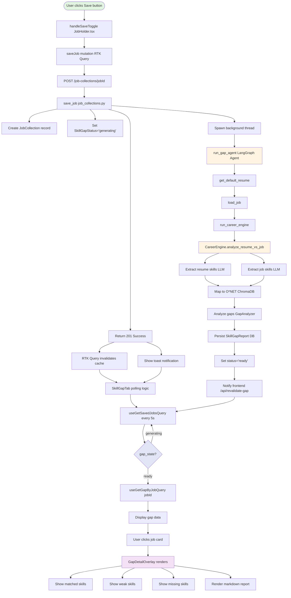

# Skill Gap Report Generation Flow - Technical Manual

> **Complete step-by-step documentation of how the Next.js frontend triggers, waits for, and displays skill gap reports generated by the Python backend.**

---

## Table of Contents

1. [Overview](#overview)
2. [High-Level Architecture](#high-level-architecture)
3. [Flowchart](#flowchart)
4. [Detailed Step-by-Step Flow](#detailed-step-by-step-flow)
   - [Phase 1: User Saves Job](#phase-1-user-saves-job)
   - [Phase 2: Backend Generates Gap Report](#phase-2-backend-generates-gap-report)
   - [Phase 3: Frontend Polling & Display](#phase-3-frontend-polling--display)
5. [Function Reference](#function-reference)
6. [Data Models](#data-models)
7. [API Endpoints](#api-endpoints)

---

## Overview

The skill gap report system is a **background processing pipeline** that:
1. Extracts skills from job descriptions and user resumes using LLMs
2. Maps skills to O*NET database (vector similarity search)
3. Analyzes gaps and calculates match scores
4. Generates detailed markdown reports
5. Serves results to the frontend via REST APIs

**Key Characteristics:**
- **Asynchronous**: Gap generation runs in background threads
- **Stateful**: Tracks status (`none`, `generating`, `ready`)
- **Polling**: Frontend polls for status updates
- **RTK Query**: Uses React Query pattern for caching and state management

---

## High-Level Architecture

```
┌─────────────────────────────────────────────────────────────────┐
│                         FRONTEND (Next.js)                      │
├─────────────────────────────────────────────────────────────────┤
│  JobHolder → saveJob() → POST /job-collections/{job_id}        │
│                                                                  │
│  SkillGapTab → useGetSavedJobsQuery() → GET /job-collections   │
│              → Polling every 5s when status="generating"        │
│              → useGetGapByJobQuery(job_id) → GET /gap/by-job/   │
│              → Display GapDetailOverlay                         │
└────────────────────────┬────────────────────────────────────────┘
                         │ HTTP REST API
                         ▼
┌─────────────────────────────────────────────────────────────────┐
│                         BACKEND (Flask)                         │
├─────────────────────────────────────────────────────────────────┤
│  job_collections.py                                             │
│    - save_job(): Sets status="generating"                       │
│    - Triggers _trigger_gap_analysis_background()                │
│                                                                  │
│  gap.py                                                         │
│    - get_gap_report_by_job(): Returns gap report                │
│                                                                  │
│  gap_agent.py (LangGraph Agent)                                 │
│    - get_default_resume(): Loads user's resume                  │
│    - load_job(): Loads job listing                              │
│    - run_career_engine(): Main processing                       │
│                                                                  │
│  career_engine.py                                               │
│    - LLMExtractor: Extracts skills with levels                  │
│    - OnetMapper: Maps to O*NET via ChromaDB                     │
│    - GapAnalyzer: Compares and scores                           │
│    - ReportRenderer: Generates markdown                         │
│    - Persists to SkillGapReport table                           │
│                                                                  │
│  Updates SkillGapStatus → status="ready"                        │
│  Notifies frontend via _notify_frontend_gap_ready()            │
└─────────────────────────────────────────────────────────────────┘
```

---

## Flowchart

### Visual Flow (Mermaid)



### Detailed Text Flow

```
START: User clicks "Save" on JobCard
│
├─► Frontend: handleSaveToggle() in JobHolder.tsx
│   └─► saveJob(jobId).unwrap()
│
├─► API Call: POST /job-collections/{jobId}
│   └─► Headers: Authorization: Bearer <token>
│
├─► Backend: save_job(job_id) in job_collections.py
│   ├─► Creates JobCollection record
│   ├─► Sets SkillGapStatus(user_id, job_id, "generating")
│   ├─► Spawns background thread: _trigger_gap_analysis_background()
│   └─► Returns 201: {message, saved: true}
│
├─► Frontend receives 201 response
│   ├─► Shows toast: "Generating skill gap report in the background..."
│   └─► RTK Query invalidates 'SavedJobs' tag
│
┌─── BACKGROUND THREAD STARTS ──────────────────────────┐
│                                                        │
│ ► gap_agent.py: run_gap_agent(user_id, job_id)        │
│   └─► LangGraph StateGraph                            │
│       ├─► Node 1: get_default_resume()                │
│       │   └─► Returns: {resume_id: int}               │
│       ├─► Node 2: load_job()                          │
│       │   └─► Returns: {}                             │
│       └─► Node 3: run_career_engine()                 │
│           └─► engine.analyze_resume_vs_job(resume_id, job_id)
│               ├─► 1. Extract skills from resume       │
│               │   └─► LLMExtractor.extract_all_in_one()
│               ├─► 2. Extract skills from job          │
│               │   └─► LLMExtractor.extract_all_in_one()
│               ├─► 3. Map to O*NET                     │
│               │   └─► OnetMapper.map_tokens()         │
│               ├─► 4. Analyze gaps                     │
│               │   └─► GapAnalyzer.compare()           │
│               ├─► 5. Persist to DB                    │
│               │   └─► SkillGapReport table            │
│               └─► Returns: {analysis_id, overall_match, ...}
│                                                        │
│ ► Set status: SkillGapStatus.set_status("ready")      │
│ ► Notify: _notify_frontend_gap_ready(job_id)          │
│   └─► POST /api/revalidate-gap (Next.js API route)   │
│                                                        │
└────────────────────────────────────────────────────────┘

┌─── FRONTEND POLLING (START) ──────────────────────────┐
│                                                        │
│ ► SkillGapTab mounts                                   │
│   └─► useGetSavedJobsQuery() called                   │
│       └─► Returns: {jobs: [{id, title, gap_state}]}   │
│                                                        │
│ ► useEffect detects hasPending = true                  │
│   └─► SetInterval: refetch() every 5000ms             │
│                                                        │
│ ► Each poll returns gap_state status:                  │
│   - "generating" → Continue polling                    │
│   - "ready" → Stop polling                             │
│                                                        │
│ ► When status="ready":                                 │
│   ├─► useGetGapByJobQuery(jobId) auto-fetches         │
│   ├─► Gap data loaded into RTK cache                  │
│   └─► Component re-renders with gap data              │
│                                                        │
│ ► User clicks job card                                 │
│   └─► setExpanded(true)                                │
│       └─► GapDetailOverlay renders                     │
│           ├─► Shows matched/weak/missing skills        │
│           ├─► Renders markdown report                  │
│           └─► Displays O*NET metadata                  │
│                                                        │
└────────────────────────────────────────────────────────┘
```

---

## Detailed Step-by-Step Flow

### Phase 1: User Saves Job

#### Step 1.1: User Interaction
**File:** `frontend/src/components/ui/jobHolder/index.tsx`

```typescript
// User clicks bookmark/save button
const handleSaveToggle = async () => {
  await saveJob(job.id).unwrap();
  toast.success("Job successfully saved.", {
    description: "Generating skill gap report in the background...",
  });
  refetchJobStatus();
};
```

**Function:** `saveJob(jobId: number)`

#### Step 1.2: RTK Query Mutation
**File:** `frontend/src/store/jobCollectionsApi.ts`

```typescript
saveJob: builder.mutation<SaveJobResponse, number>({
  query: (jobId) => ({
    url: `job-collections/${jobId}`,
    method: 'POST',
  }),
  invalidatesTags: ['SavedJobs'],
})
```

**Action:** Calls `useSaveJobMutation()`

#### Step 1.3: HTTP Request
**Endpoint:** `POST /job-collections/{job_id}`
**Headers:**
- `Authorization: Bearer <JWT>`
- `Content-Type: application/json`

#### Step 1.4: Backend Handler
**File:** `jobmate_agent/blueprints/api/job_collections.py`

```python
@api_bp.route("/job-collections/<int:job_id>", methods=["POST"])
@require_jwt(hydrate=True)
def save_job(job_id):
    # Get authenticated user
    user_profile = g.user_profile
    
    # Create JobCollection record
    job_collection = JobCollection(
        user_id=user_profile.id,
        job_listing_id=job_id,
        added_at=datetime.now(timezone.utc),
    )
    db.session.add(job_collection)
    db.session.commit()
    
    # Set status to "generating"
    SkillGapStatus.set_status(user_profile.id, job_id, "generating")
    
    # Spawn background thread
    from flask import current_app
    app = current_app._get_current_object()
    _trigger_gap_analysis_background(user_profile.id, job_id, app)
    
    return jsonify({
        "message": "Job saved successfully",
        "saved": True,
        "saved_at": job_collection.added_at.isoformat(),
    }), 201
```

**Function:** `save_job(job_id: int)`

---

### Phase 2: Backend Generates Gap Report

#### Step 2.1: Background Thread Spawned
**File:** `jobmate_agent/blueprints/api/job_collections.py`

```python
def _trigger_gap_analysis_background(user_id: str, job_id: int, app):
    def _run_with_context():
        with app.app_context():
            result = run_gap_agent(user_id, job_id)
            
            if result.get("analysis_id"):
                SkillGapStatus.set_status(user_id, job_id, "ready")
                _notify_frontend_gap_ready(job_id)
            else:
                SkillGapStatus.clear_status(user_id, job_id)
    
    thread = threading.Thread(target=_run_with_context, daemon=True)
    thread.start()
```

**Function:** `_trigger_gap_analysis_background()`

#### Step 2.2: LangGraph Agent Execution
**File:** `jobmate_agent/agents/gap_agent.py`

```python
def run_gap_agent(user_id: str, job_id: int) -> Dict[str, Any]:
    builder = StateGraph(GapState)
    builder.add_node(get_default_resume)
    builder.add_node(load_job)
    builder.add_node(run_career_engine)
    builder.add_edge(START, "get_default_resume")
    builder.add_edge("get_default_resume", "load_job")
    builder.add_edge("load_job", "run_career_engine")
    builder.add_edge("run_career_engine", END)
    graph = builder.compile()
    out = graph.invoke({"user_id": user_id, "job_id": job_id})
    return out.get("result", {})
```

**Function:** `run_gap_agent()`

**LangGraph Nodes:**
1. **get_default_resume(state)** → Returns `{resume_id: int}`
   - Loads user's default resume from DB
   
2. **load_job(state)** → Returns `{}`
   - Validates job exists, logs metadata
   
3. **run_career_engine(state)** → Returns `{result: {...}}`
   - Invokes CareerEngine.analyze_resume_vs_job()

#### Step 2.3: Career Engine Analysis
**File:** `jobmate_agent/services/career_engine/career_engine.py`

```python
def analyze_resume_vs_job(
    self, resume_id: int, job_id: int
) -> Dict[str, Any]:
    # 1. Load resume and job text
    resume = Resume.query.get(resume_id)
    job_listing = JobListing.query.get(job_id)
    resume_text = get_resume_text(resume)
    job_text = "\n\n".join([job_listing.description, job_listing.requirements])
    
    # 2. Extract skills with LLM
    res_aio = self.extractor.extract_all_in_one(
        resume_text, is_job_description=False
    )
    job_aio = self.extractor.extract_all_in_one(
        job_text, is_job_description=True
    )
    
    # 3. Map to O*NET database
    resume_map = self._map_with_levels(res_aio, resume_text, is_resume=True)
    job_map = self._map_with_levels(job_aio, job_text, is_resume=False)
    
    # 4. Analyze gaps
    result = self.analyzer.compare(resume_map, job_map)
    
    # 5. Persist to database
    rec = SkillGapReport(
        user_id=resume.user_id,
        resume_id=resume_id,
        job_listing_id=job_id,
        matched_skills_json=result["matched_skills"],
        missing_skills_json=result["missing_skills"],
        weak_skills_json=result.get("nice_to_have"),
        score=result["overall_match"],
    )
    db.session.add(rec)
    db.session.commit()
    
    # 6. Generate markdown report
    result["report_md"] = self.renderer.render(result)
    result["analysis_id"] = rec.id
    
    return result
```

**Function:** `CareerEngine.analyze_resume_vs_job()`

**Sub-components:**

**2.3.1: LLM Extractor**
- **File:** `llm_extractor.py`
- Uses GPT to extract skills with proficiency levels
- Returns structured JSON with evidence spans

**2.3.2: O*NET Mapper**
- **File:** `onet_mapper.py`
- Vector similarity search via ChromaDB
- Maps extracted skills to O*NET taxonomy

**2.3.3: Gap Analyzer**
- **File:** `gap_analyzer.py`
- Compares resume vs job skills
- Calculates match score (0-10)
- Categorizes: matched, missing, weak skills

#### Step 2.4: Status Update & Notification
**File:** `jobmate_agent/blueprints/api/job_collections.py`

```python
if result.get("analysis_id"):
    SkillGapStatus.set_status(user_id, job_id, "ready")
    _notify_frontend_gap_ready(job_id)
```

**File:** `jobmate_agent/blueprints/api/gap.py`

```python
def _notify_frontend_gap_ready(job_id: int) -> None:
    frontend_origin = os.getenv("FRONTEND_ORIGIN")
    url = frontend_origin + "/api/revalidate-gap"
    requests.post(url, json={"jobId": job_id}, headers={...})
```

**Function:** `_notify_frontend_gap_ready()`

---

### Phase 3: Frontend Polling & Display

#### Step 3.1: Component Initialization
**File:** `frontend/src/components/profile/SkillGapTab.tsx`

```typescript
export default function SkillGapTab() {
  const { data, isLoading, refetch } = useGetSavedJobsQuery(undefined, {
    refetchOnFocus: true,
    refetchOnReconnect: true,
  });
  
  const displayJobs = useMemo(
    () => jobs.filter(job => 
      job.gap_state === "ready" || job.gap_state === "generating"
    ),
    [jobs]
  );
  
  const hasPending = useMemo(
    () => displayJobs.some(job => job.gap_state === "generating"),
    [displayJobs]
  );
```

**Function:** `SkillGapTab()`

#### Step 3.2: Polling Logic
**File:** `frontend/src/components/profile/SkillGapTab.tsx`

```typescript
useEffect(() => {
  if (!hasPending) return;
  const id = setInterval(() => {
    refetch();
  }, 5000);
  return () => clearInterval(id);
}, [hasPending, refetch]);
```

**Behavior:** Polls every 5 seconds while any job has `gap_state="generating"`

#### Step 3.3: Fetch Saved Jobs
**File:** `frontend/src/store/jobCollectionsApi.ts`

```typescript
getSavedJobs: builder.query<JobCollectionsResponse, void>({
  query: () => 'job-collections',
  providesTags: ['SavedJobs'],
})
```

**Endpoint:** `GET /job-collections`

**Response:**
```json
{
  "jobs": [
    {
      "id": 123,
      "title": "Senior Frontend Engineer",
      "company": "Tech Corp",
      "gap_state": "generating",  // or "ready" or "none"
      "bookmarked": true
    }
  ]
}
```

**Function:** `useGetSavedJobsQuery()`

#### Step 3.4: Fetch Gap Report
**File:** `frontend/src/components/profile/SkillGapTab.tsx`

```typescript
const activeJob = useMemo(
  () => displayJobs.find(job => job.id === selectedJobId),
  [displayJobs, selectedJobId]
);

const shouldFetchActiveGap = activeJob && activeJob.gap_state === "ready";
const { data: gap, isLoading: gapLoading } = useGetGapByJobQuery(
  activeJob?.id as number,
  {
    skip: !shouldFetchActiveGap,
    // Don't refetch if we have cached data (cache lasts 1 hour)
    refetchOnMountOrArgChange: false,
    refetchOnFocus: false,
  }
);
```

**RTK Query Hook:** `useGetGapByJobQuery()`

**File:** `frontend/src/store/gapApi.ts`

```typescript
getGapByJob: builder.query<GapGetByJobResponse, number>({
  query: (jobId) => `gap/by-job/${jobId}`,
  providesTags: (result, error, jobId) => [
    { type: 'GapByJob', id: jobId },
  ],
  keepUnusedDataFor: 3600, // 1 hour - cache gap data for ready jobs
})
```

**Endpoint:** `GET /gap/by-job/{job_id}`

**Backend Handler:**
**File:** `jobmate_agent/blueprints/api/gap.py`

```python
@api_bp.route("/gap/by-job/<int:job_id>", methods=["GET"])
def get_gap_report_by_job(job_id: int):
    user_id = g.user_sub
    resume = _get_default_resume_for_user(user_id)
    
    rec = SkillGapReport.query.filter_by(
        resume_id=resume.id, job_listing_id=job_id
    ).order_by(SkillGapReport.created_at.desc()).first()
    
    if not rec:
        return jsonify({"exists": False}), 200
    
    # Render markdown
    renderer = ReportRenderer()
    report_md = renderer.render({
        "overall_match": rec.score,
        "matched_skills": rec.matched_skills_json,
        "missing_skills": rec.missing_skills_json,
        "weak_skills": rec.weak_skills_json,
    })
    
    return jsonify({
        "exists": True,
        "id": rec.id,
        "score": rec.score,
        "matched_skills": rec.matched_skills_json,
        "missing_skills": rec.missing_skills_json,
        "weak_skills": rec.weak_skills_json,
        "report_md": report_md,
    }), 200
```

**Function:** `get_gap_report_by_job()`

**Response:**
```json
{
  "exists": true,
  "id": 456,
  "score": 0.75,
  "matched_skills": [{...}],
  "missing_skills": [{...}],
  "weak_skills": [{...}],
  "report_md": "# Skill Gap Report\n\n..."
}
```

#### Step 3.5: Display Gap Report
**File:** `frontend/src/components/profile/SkillGapTab.tsx`

```typescript
const GapDetailOverlay = ({ gap, loading, onClose, job }) => {
  const matched = gap?.matched_skills || [];
  const missing = gap?.missing_skills || [];
  const weak = gap?.weak_skills || [];
  
  const reportHtml = useMemo(() => {
    if (!gap?.report_md) return null;
    const html = marked.parse(gap.report_md);
    return DOMPurify.sanitize(html);
  }, [gap?.report_md]);
  
  return (
    <motion.div className="fixed inset-0 z-40 bg-black/40">
      <div className="h-[70vh] w-full max-w-3xl bg-white rounded-3xl">
        <header>
          <h3>{job?.title}</h3>
          <span>Overall match {Math.round(gap?.score * 100)}%</span>
        </header>
        <div className="overflow-y-auto">
          <SkillListSection title="Matched skills" items={matched} />
          <SkillListSection title="Weak skills" items={weak} />
          <SkillListSection title="Missing skills" items={missing} />
          <div dangerouslySetInnerHTML={{ __html: reportHtml }} />
        </div>
      </div>
    </motion.div>
  );
};
```

**Component:** `GapDetailOverlay()`

---

## Function Reference

### Frontend Functions

| Function | File | Purpose |
|----------|------|---------|
| `handleSaveToggle()` | `jobHolder/index.tsx` | User clicks save button |
| `saveJob()` | `jobCollectionsApi.ts` | RTK Query mutation |
| `useGetSavedJobsQuery()` | `jobCollectionsApi.ts` | Fetch saved jobs with gap_state |
| `useGetGapByJobQuery()` | `gapApi.ts` | Fetch gap report for job |
| `refetch()` | Auto-generated | Poll for updates |
| `GapDetailOverlay()` | `SkillGapTab.tsx` | Render gap report modal |
| `SkillListSection()` | `SkillGapTab.tsx` | Display skill list |

### Backend Functions

| Function | File | Purpose |
|----------|------|---------|
| `save_job()` | `job_collections.py` | Handle save request, spawn thread |
| `_trigger_gap_analysis_background()` | `job_collections.py` | Spawn background thread |
| `run_gap_agent()` | `gap_agent.py` | LangGraph agent orchestration |
| `get_default_resume()` | `gap_agent.py` | Load user resume |
| `load_job()` | `gap_agent.py` | Validate job exists |
| `run_career_engine()` | `gap_agent.py` | Invoke career engine |
| `analyze_resume_vs_job()` | `career_engine.py` | Main analysis pipeline |
| `extract_all_in_one()` | `llm_extractor.py` | Extract skills with LLM |
| `map_tokens()` | `onet_mapper.py` | Map to O*NET |
| `compare()` | `gap_analyzer.py` | Analyze gaps, calculate score |
| `get_gap_report_by_job()` | `gap.py` | Return gap report |
| `_notify_frontend_gap_ready()` | `gap.py` | Notify frontend |

---

## Data Models

### Frontend Types

```typescript
type Job = {
  id: number;
  title: string;
  company: string;
  gap_state: "none" | "generating" | "ready";
  saved_at: string;
  bookmarked: boolean;
};

type GapGetByJobResponse = {
  exists: boolean;
  id: number;
  score: number;
  matched_skills: SkillEntry[];
  missing_skills: SkillEntry[];
  weak_skills: SkillEntry[];
  report_md?: string;
};

type SkillEntry = string | SkillObject | null;

type SkillObject = {
  name?: string;
  level_delta?: number;
  match?: SkillMatch;
  [key: string]: unknown;
};
```

### Backend Models

```python
class SkillGapStatus(db.Model):
    user_id: str
    job_listing_id: int
    status: str  # "generating" or "ready"

class SkillGapReport(db.Model):
    user_id: str
    resume_id: int
    job_listing_id: int
    matched_skills_json: JSON
    missing_skills_json: JSON
    weak_skills_json: JSON
    score: float  # 0.0 to 10.0
    created_at: datetime
```

---

## API Endpoints

| Method | Endpoint | Purpose | Returns |
|--------|----------|---------|---------|
| POST | `/job-collections/{job_id}` | Save job | `{message, saved, saved_at}` |
| GET | `/job-collections` | Get saved jobs | `{jobs: [{...}], total_count}` |
| DELETE | `/job-collections/{job_id}` | Unsave job | `{message, saved}` |
| POST | `/backend/gap/run` | Manually trigger gap (API) | `{gap_report_id, score, report_md}` |
| GET | `/gap/by-job/{job_id}` | Get gap report | `{exists, id, score, skills, report_md}` |
| DELETE | `/backend/gap/by-job/{job_id}` | Delete gap report | `{deleted}` |

---

## Key Design Decisions

1. **Asynchronous Processing**: Gap generation is CPU/LLM-intensive, so it runs in background threads to avoid blocking API responses.

2. **State Management**: `SkillGapStatus` table tracks generation state, enabling efficient polling without querying heavy report tables.

3. **Polling Frequency**: 5-second polling balances responsiveness vs server load.

4. **RTK Query**: Provides caching, automatic refetching, and optimistic updates.

5. **Caching**: Gap reports are cached for 1 hour to prevent redundant API calls when polling for generating jobs. Prefetching has been removed to eliminate unnecessary fetches.

6. **Persistent Reports**: Reports are stored in `SkillGapReport` for historical tracking and quick retrieval.

---

## Error Handling

- **Missing Resume**: 404 if user has no default resume
- **Job Not Found**: 404 if job_id doesn't exist
- **Generation Failure**: Status cleared, user can retry
- **Network Errors**: RTK Query retries with exponential backoff
- **LLM Failures**: Extractor falls back to keyword-based extraction

---

## Performance Considerations

- **Background Processing**: Non-blocking API responses
- **Caching**: RTK Query caches gap reports for 1 hour for ready jobs, preventing refetches during polling
- **Polling**: Only `/job-collections` is polled; gap data respects cache until explicitly invalidated
- **Database Queries**: Polling queries lightweight `SkillGapStatus` table to detect state transitions
- **Pagination**: `/job-collections` supports pagination if needed
- **Database Indexes**: Indexed on `(user_id, job_listing_id)` for fast lookups

---

**End of Manual**

