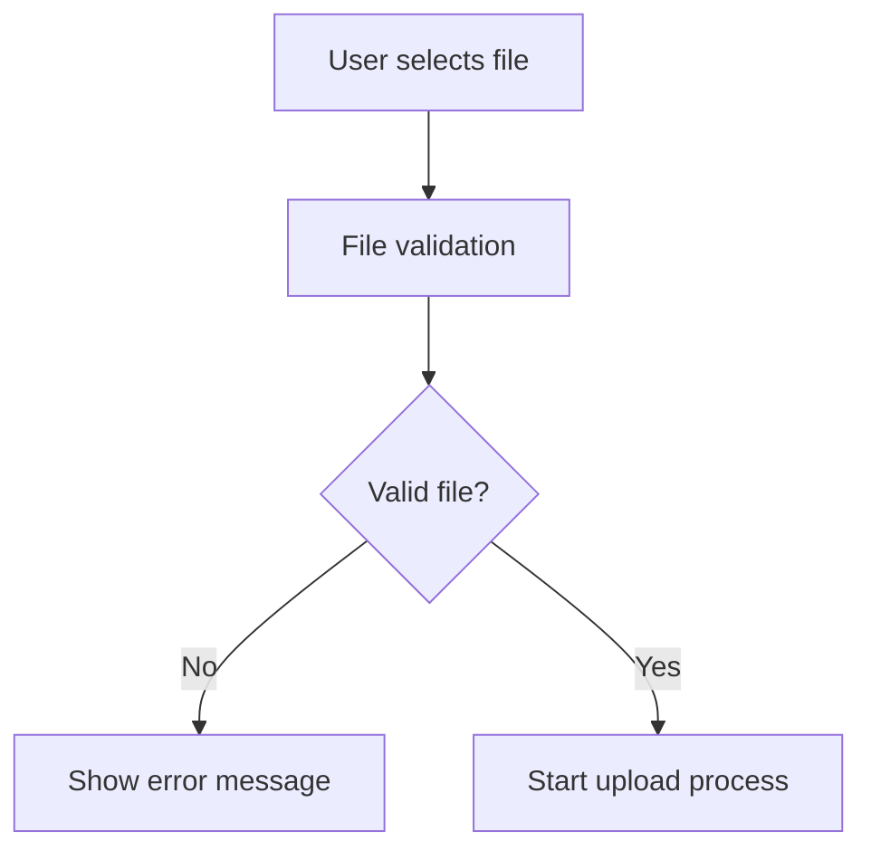
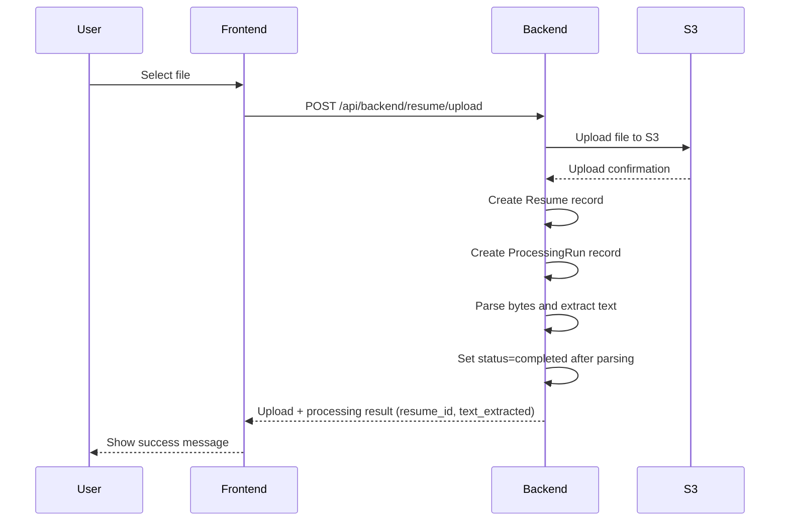
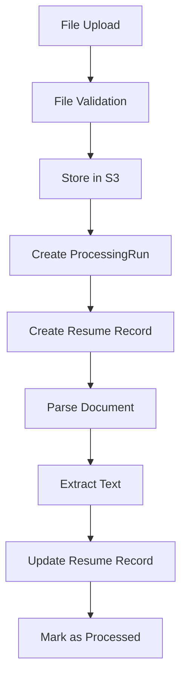

# Resume Upload Workflow

## Overview

This document outlines the complete workflow for resume upload, processing, and future implementation plans for the Jobmate.agent system. The workflow covers the entire journey from user file selection to parsing and storage.

## Table of Contents

1. [Current Implementation](#current-implementation)
2. [Upload Workflow Steps](#upload-workflow-steps)
3. [Database Schema](#database-schema)
4. [Future Implementation Plans](#future-implementation-plans)
5. [Processing Pipeline](#processing-pipeline)
6. [Error Handling](#error-handling)
7. [Security Considerations](#security-considerations)

## Current Implementation

### Frontend Components

#### ResumeUploadArea Component
- **Location**: `frontend/src/components/upload/ResumeUploadArea.tsx`
- **Features**:
  - Drag & drop file upload
  - File validation (type, size)
  - Progress tracking
  - Upload cancellation
  - Error handling

#### ResumeManageDrawer Component
- **Location**: `frontend/src/components/profile/ResumeManageDrawer.tsx`
- **Features**:
  - Resume list display
  - 3-dots menu for each resume
  - Set default functionality
  - Download functionality (presigned URL)
  - Delete functionality
  - S3 file cleanup

### Backend API Endpoints

#### Upload Endpoints
- `POST /api/backend/resume/upload` - Direct file upload (Primary method)
// Removed: `POST /api/backend/resume/upload-complete` (deprecated)

#### Local File Persistence
- By default, uploaded files are NOT written to local disk.
- To persist a local copy (useful in dev/debug), set `STORE_LOCAL_UPLOAD_COPY=1`.
- Tests that pass an explicit `upload_dir` will write a local file for assertions regardless of the flag.

#### Management Endpoints
- `GET /api/backend/resumes` - List user resumes
- `POST /api/backend/resumes/{id}/set-default` - Set default resume
- `DELETE /api/backend/resumes/{id}` - Delete resume
- `GET /api/backend/resume/{id}/download-url` - Get download URL

## Upload Workflow Steps

### 1. User File Selection



**File Validation Rules:**
- **File types**: PDF, DOC, DOCX, TXT
- **File size**: Maximum 10MB
- **Content validation**: Basic file header checks

### 2. Upload Process

#### Primary Method: Direct Upload (Current Implementation)



### 3. Database Record Creation

#### ProcessingRun Record
```sql
INSERT INTO processing_runs (
    created_at,
    llm_model,
    embed_model,
    code_version_hash,
    params_json
) VALUES (
    NOW(),
    'n/a',
    'n/a',
    'v1.0.0',
    '{"max_tokens": 1000}'
);
```

#### Resume Record
```sql
INSERT INTO resumes (
    user_id,
    s3_bucket,
    s3_key,
    original_filename,
    file_size,
    content_type,
    parsed_json,
    processing_run_id,
    is_default,
    status,
    created_at
) VALUES (
    'user_123',
    'jobmate-agent-bucket',
    'resumes/user_123/uuid.pdf',
    'resume.pdf',
    1024000,
    'application/pdf',
    '{"page_count":2,"word_count":1234,"warnings":[],"text_preview":"First 1000 chars...","raw_text_sha256":"..."}',
    1,
    true,
    'completed',
    NOW()
);
```

## Database Schema

### Resume Table
```sql
CREATE TABLE resumes (
    id SERIAL PRIMARY KEY,
    user_id VARCHAR NOT NULL REFERENCES user_profiles(id),
    s3_bucket VARCHAR,                  -- S3 bucket name
    s3_key VARCHAR,                     -- S3 object key
    original_filename VARCHAR,          -- Original filename
    file_size BIGINT,                   -- File size in bytes
    content_type VARCHAR,               -- MIME type
    parsed_json JSON,                   -- Parsed content
    processing_run_id INTEGER NOT NULL REFERENCES processing_runs(id),
    is_default BOOLEAN DEFAULT FALSE,    -- Default resume flag
    status VARCHAR DEFAULT 'processing', -- Processing status
    created_at TIMESTAMP WITH TIME ZONE DEFAULT NOW()
);
```

### ProcessingRun Table
```sql
CREATE TABLE processing_runs (
    id SERIAL PRIMARY KEY,
    created_at TIMESTAMP DEFAULT NOW(),
    llm_model VARCHAR,                  -- LLM model used
    embed_model VARCHAR,                -- Embedding model used
    code_version_hash VARCHAR,          -- Code version
    params_json JSON                    -- Processing parameters
);
```

## Future Implementation Plans

### Phase 1: Document Processing Pipeline

#### 1.1 File Parsing
```python
# services/document_parser.py
class DocumentParser:
    def parse_pdf(self, file_path: str) -> dict:
        """Extract text and metadata from PDF"""
        pass
    
    def parse_docx(self, file_path: str) -> dict:
        """Extract text and metadata from DOCX"""
        pass
    
    def extract_sections(self, text: str) -> dict:
        """Extract resume sections (experience, education, skills)"""
        pass
```

#### 1.2 Content Extraction
- **Text extraction**: PDF, DOCX, TXT parsing
- **Section identification**: Experience, Education, Skills, Contact
- **Metadata extraction**: File info, creation date, author
- **Content validation**: Resume format validation

### Phase 2: AI Processing Pipeline

#### 2.1 LLM Processing
```python
# services/llm_processor.py
class LLMProcessor:
    def extract_skills(self, text: str) -> list:
        """Extract skills using LLM"""
        pass
    
    def extract_experience(self, text: str) -> list:
        """Extract work experience"""
        pass
    
    def extract_education(self, text: str) -> list:
        """Extract education history"""
        pass
    
    def generate_summary(self, text: str) -> str:
        """Generate resume summary"""
        pass
```

#### 2.2 Skill Extraction
- **Skill identification**: Technical and soft skills
- **Skill categorization**: Programming, languages, tools
- **Experience level**: Beginner, Intermediate, Advanced
- **Skill confidence**: AI confidence scores

### Phase 3: Vector Embedding Pipeline

#### 3.1 Text Chunking
```python
# services/text_chunker.py
class TextChunker:
    def chunk_resume(self, text: str) -> list:
        """Split resume into semantic chunks"""
        pass
    
    def create_overlapping_chunks(self, text: str) -> list:
        """Create overlapping chunks for better context"""
        pass
```

#### 3.2 Embedding Generation
```python
# services/embedding_service.py
class EmbeddingService:
    def generate_embeddings(self, chunks: list) -> list:
        """Generate embeddings for text chunks"""
        pass
    
    def store_embeddings(self, embeddings: list, doc_id: str):
        """Store embeddings in vector database"""
        pass
```

### Phase 4: Vector Storage

#### 4.1 Vector Database Integration
```python
# services/vector_store.py
class VectorStore:
    def store_document(self, doc_id: str, chunks: list, embeddings: list):
        """Store document in vector database"""
        pass
    
    def search_similar(self, query: str, limit: int = 10) -> list:
        """Search for similar documents"""
        pass
    
    def update_document(self, doc_id: str, new_chunks: list):
        """Update existing document"""
        pass
```

## Processing Pipeline

### Complete Workflow Diagram



### Local Disk Writes
- Local write of original files is disabled by default.
- Enable with `STORE_LOCAL_UPLOAD_COPY=1` or provide an explicit `upload_dir` when calling ingest utilities.

### Future LLM Processing (not yet implemented)
- Extract skills
- Extract experience
- Generate summary

### Processing States

#### Resume Processing States
1. **uploaded** - File uploaded to S3
2. **parsing** - Document being parsed
3. **processing** - LLM processing (future)
4. **completed** - Processing complete
5. **failed** - Processing failed

#### Error Recovery
- **Retry mechanism**: Automatic retry for transient failures
- **Partial processing**: Resume from last successful step
- **Error logging**: Detailed error tracking
- **User notification**: Status updates to user

## Error Handling

### Upload Errors
- **File validation errors**: Invalid type, size, format
- **Network errors**: Connection timeouts, upload failures
- **Storage errors**: S3 errors, quota exceeded
- **Authentication errors**: Invalid tokens, expired sessions

### Processing Errors
- **Parsing errors**: Corrupted files, unsupported formats
- **LLM errors**: API failures, rate limits
- **Embedding errors**: Model failures, timeout
- **Database errors**: Connection issues, constraint violations

### Error Recovery Strategies
```python
# services/error_handler.py
class ErrorHandler:
    def handle_upload_error(self, error: Exception) -> str:
        """Handle upload-specific errors"""
        pass
    
    def handle_processing_error(self, error: Exception) -> str:
        """Handle processing-specific errors"""
        pass
    
    def retry_processing(self, resume_id: int) -> bool:
        """Retry processing for failed resumes"""
        pass
```

## Security Considerations

### File Security
- **File type validation**: Whitelist allowed file types
- **Size limits**: Prevent large file uploads
- **Virus scanning**: Scan uploaded files
- **Content validation**: Check for malicious content

### Data Security
- **Encryption**: Encrypt files at rest in S3
- **Access control**: User-specific S3 keys
- **Data retention**: Automatic cleanup of old files
- **Privacy**: No sharing of user data

### API Security
- **Authentication**: JWT token validation
- **Rate limiting**: Prevent abuse
- **Input validation**: Sanitize all inputs
- **CORS**: Proper cross-origin configuration

## Implementation Timeline

### Phase 1 (Current)
- ✅ Basic file upload (using `/resume/upload`)
- ✅ S3 storage
- ✅ Database records
- ✅ User interface
- ✅ Simplified to single upload endpoint

### Phase 2 (Next 2 weeks)
- 🔄 Document parsing
- 🔄 Text extraction
- 🔄 Basic chunking
- 🔄 Error handling

### Phase 3 (Next month)
- 📋 LLM integration
- 📋 Skill extraction
- 📋 Experience parsing
- 📋 Summary generation

### Phase 4 (Future)
- 📋 Advanced processing

## Monitoring and Analytics

### Metrics to Track
- **Upload success rate**: Percentage of successful uploads
- **Processing time**: Time from upload to completion
- **Error rates**: Frequency of different error types
- **User engagement**: Upload frequency per user

### Logging
- **Upload logs**: File details, user, timestamp
- **Processing logs**: Steps completed, errors encountered
- **Performance logs**: Processing times, resource usage
- **Error logs**: Detailed error information

## Conclusion

This workflow provides a comprehensive foundation for resume upload and processing in the Jobmate.agent system. The current implementation handles basic upload functionality, while the future phases will add sophisticated AI processing capabilities including document parsing, skill extraction, and vector embedding for advanced job matching and recommendation features.

The modular design allows for incremental implementation and testing of each component, ensuring a robust and scalable system that can grow with user needs and technological advances.
